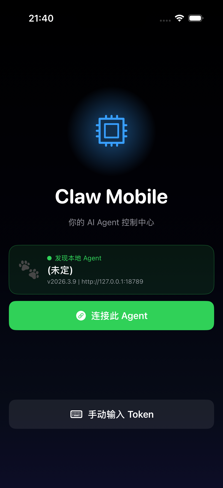
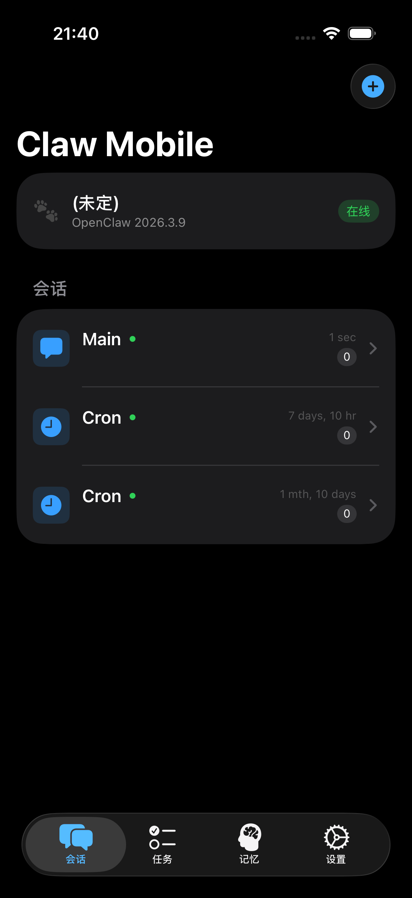
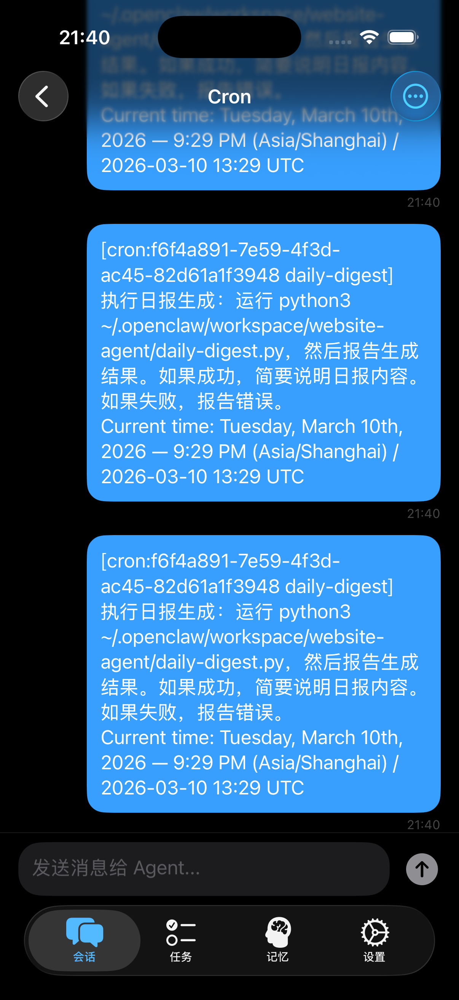
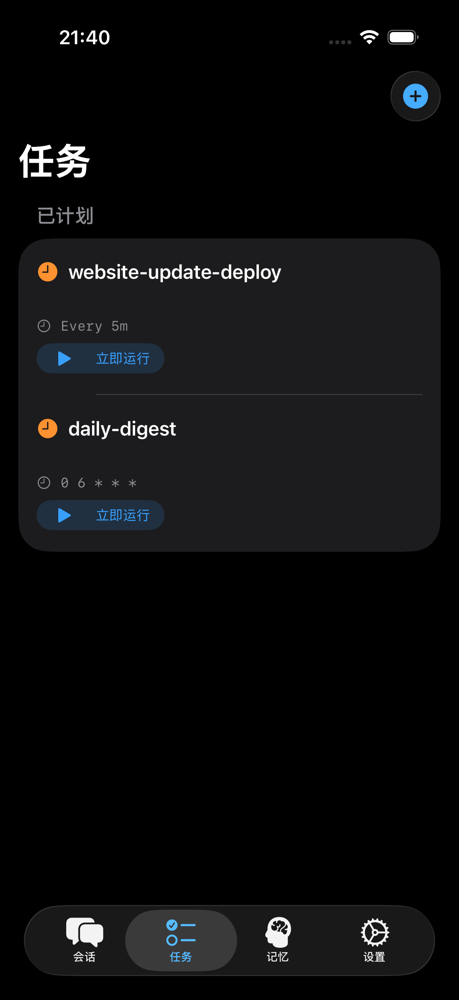
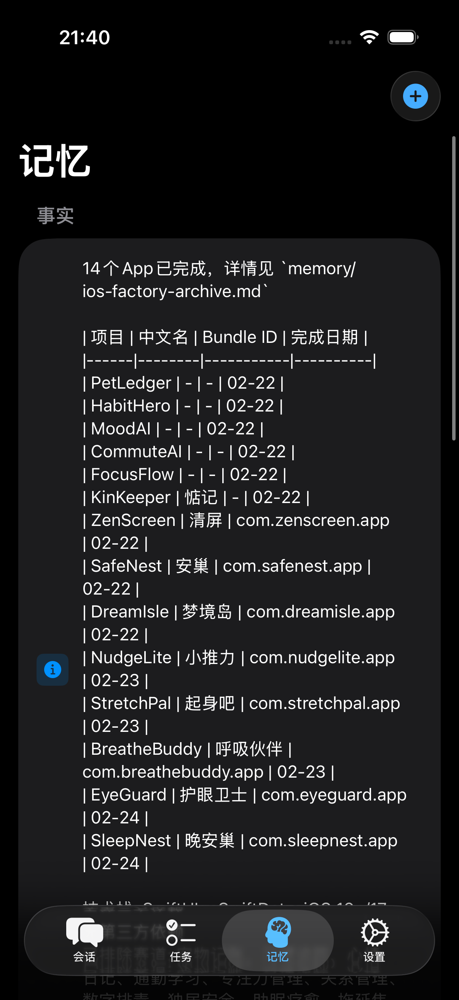
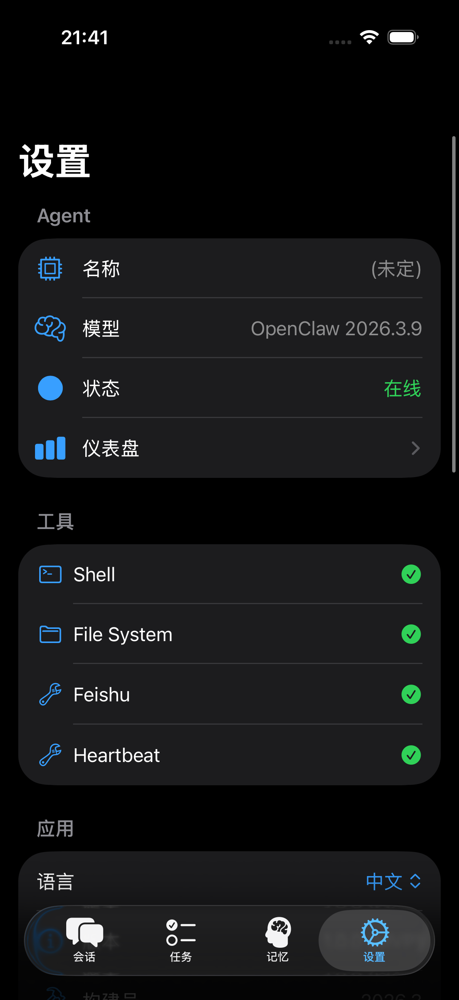

# Claw Mobile

**Your AI Agent Control Center**

[English](README_EN.md)

Claw Mobile 是 [OpenClaw](https://github.com/openclaw/openclaw) 生态的 iOS 客户端，用于远程管理、控制和监控 AI Agent。它不是一个聊天工具，而是 AI Agent 的移动端操作系统。

> AI Agent = Digital Worker, Chat = Command Line, Claw Mobile = GUI

## 截图

| 连接 | 会话列表 | 对话 |
|:---:|:---:|:---:|
|  |  |  |

| 定时任务 | 记忆 | 设置 |
|:---:|:---:|:---:|
|  |  |  |

## 功能概览

| 模块 | 说明 |
|------|------|
| **Agent Connect** | 自动发现本地 Agent 或通过 Token 连接 |
| **Session Chat** | 多会话管理，支持流式响应和 Tool Call 可视化 |
| **Tool Approval** | 对 Agent 的危险操作（Shell、文件删除等）进行审批 |
| **Task Automation** | 创建、查看和管理定时自动化任务（Cron 调度） |
| **Memory Management** | 浏览 Agent 的长期记忆（事实/偏好/知识） |
| **多语言支持** | 默认中文，可在设置中切换为 English |

## 技术栈

| 层级 | 技术选型 |
|------|---------|
| UI 框架 | SwiftUI |
| 架构模式 | MVVM + @Observable |
| 实时通信 | WebSocket |
| 本地存储 | UserDefaults |
| 最低版本 | iOS 18.0 |
| 构建工具 | XcodeGen |

## 快速开始

### 环境要求

- macOS 15+
- Xcode 16+
- [XcodeGen](https://github.com/yonaskolb/XcodeGen)（`brew install xcodegen`）
- 本地运行的 [OpenClaw](https://github.com/openclaw/openclaw) Agent

### 构建和运行

```bash
# 1. 克隆项目
git clone <repo-url> && cd clawmobile

# 2. 生成 Xcode 项目
xcodegen generate

# 3. 构建
xcodebuild -project ClawMobile.xcodeproj \
  -scheme ClawMobile \
  -destination 'platform=iOS Simulator,name=iPhone 17' \
  build

# 4. 安装到模拟器
xcrun simctl install booted \
  ~/Library/Developer/Xcode/DerivedData/ClawMobile-*/Build/Products/Debug-iphonesimulator/ClawMobile.app

# 5. 启动
xcrun simctl launch booted com.openclaw.ClawMobile
```

或直接在 Xcode 中打开 `ClawMobile.xcodeproj`，选择模拟器后点击 Run。

## 项目结构

```
clawmobile/
├── README_EN.md                       # 英文文档
├── readme.md                          # 中文文档（本文件）
├── project.yml                        # XcodeGen 项目配置
├── docs/
│   ├── screen/                        # App 截图
│   ├── PRD.md                         # 产品需求文档
│   ├── TECHNICAL_DESIGN.md            # 技术设计文档
│   └── RESEARCH.md                    # 前期调研与分析
└── ClawMobile/
    ├── ClawMobileApp.swift            # App 入口
    ├── Models/                        # 数据模型
    ├── ViewModels/                    # 视图模型（MVVM）
    ├── Views/                         # UI 视图
    ├── Services/
    │   ├── OpenClawService.swift      # WebSocket 客户端
    │   └── L10n.swift                 # 国际化
    └── Assets.xcassets/
```

## 开发路线

| 阶段 | 内容 | 状态 |
|------|------|------|
| **MVP** | Agent 连接、会话聊天、流式响应、工具日志、任务列表、多语言 | 已完成 |
| **V1.0** | 真实 WebSocket 接入、Agent 自动发现、定时任务管理、记忆浏览 | 已完成 |
| **V1.1** | 本地缓存（SQLite）、推送通知 | 规划中 |
| **V2** | 语音 Agent 控制 | 规划中 |
| **V3** | 多 Agent 协同 | 规划中 |
| **V4** | Agent / Skill 市场 | 规划中 |

## 文档索引

| 文档 | 说明 |
|------|------|
| [产品需求文档](docs/PRD.md) | 产品定义、用户场景、功能模块、信息架构 |
| [技术设计文档](docs/TECHNICAL_DESIGN.md) | 系统架构、API 设计、数据模型、安全设计 |
| [前期调研](docs/RESEARCH.md) | OpenClaw 架构分析、市场机会、产品定位推演 |

## 许可证

MIT
